# Setting up the CI/CD in Jenkins

## Plan to set up the CI/CD in Jenkins

1. generate the ssh keypair in the .ssh folder
2. copy name_jenkin.pub
3. copy name_jenkins/private key to jenkins 
4. build a jenkins job with the repo trigger the job
	- app folder/code on github
	- cd ap
	- npm install
	- npm test pass/fail

## Jenkins Walkthrough

Make a new Item in jenkins and label it as per the naming convention , name-CI

In the configuration post bild actions:
- tick discard old builds, log rotation for a maximum of 3 builds.
- tick Github project with your HTTPS url copied from your repository

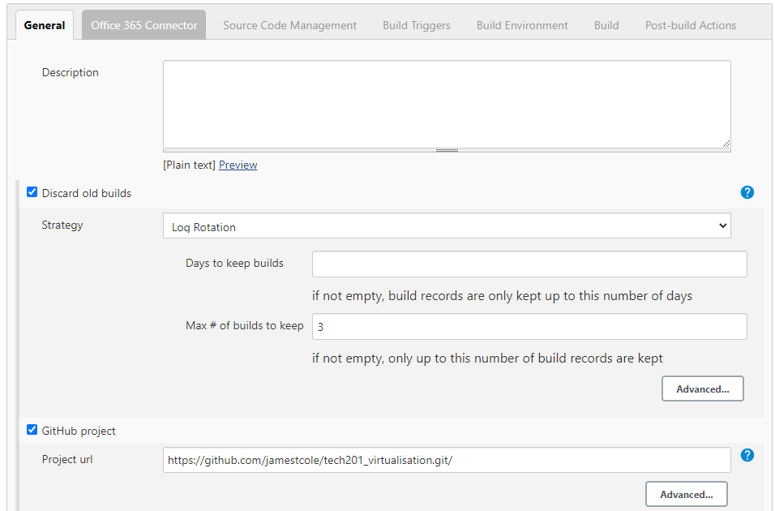

In the office 365 connector:
- tick restrict whre this project can be run and fill in the label expression, sparta-ubuntu-node

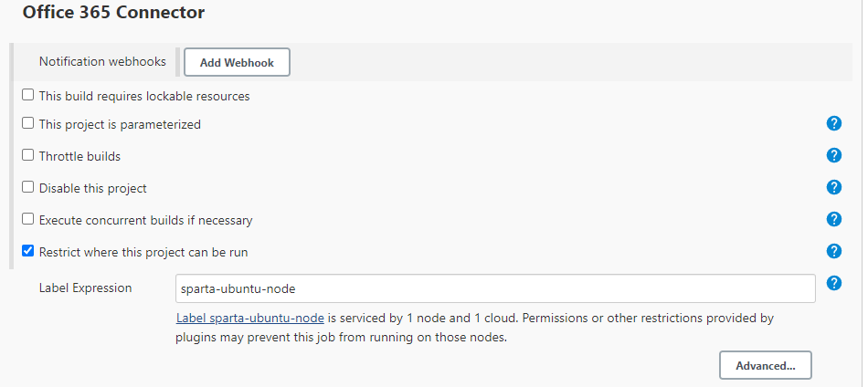

In the source code management:
- tick the Git box and add the ssh repository url, then add the key that you created earlier.
- change the branch specifier to main

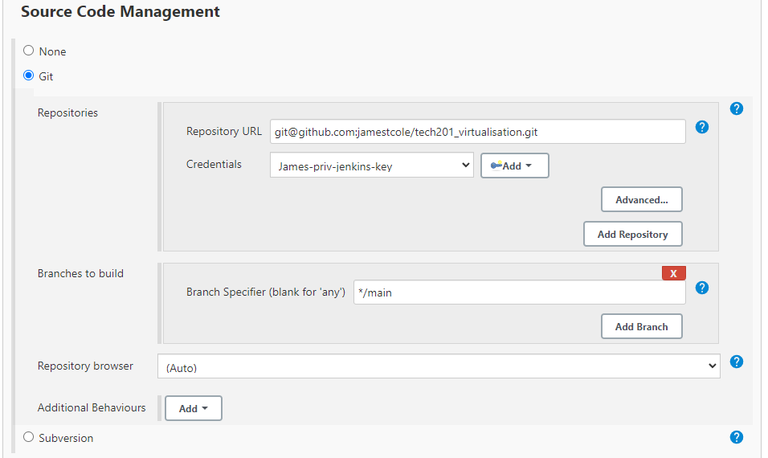

### How to create the key pair and deploy public key

To create the public and private key pair in gitbash , insert your email address in the following commands.

`cd .ssh`

`ssh-keygen -t rsa -b 4096 -C "JCole@spartaglobal.com"`

Once you have completed this, you can write (insert your keyname):

`cat keyname.pub`

This can now be copied into your repository settings on GitHub, got to settings, Deploy keys and copy without any spaces, then add the key.

## How to Add the private key:
click on the add key button, add your private key, this can be found by looking in your ssh folder. there should be a key labeled as the one you made earlier. 

`cd .ssh`

`cat keyname`

You can now copy and paste the output, remember to leave no spaces.

In build environment:
- tick Provide Node and npm bin/ folder to PATH
- NodeJS Installation is Sparta-Node-JS
- The Cache should fill in by default

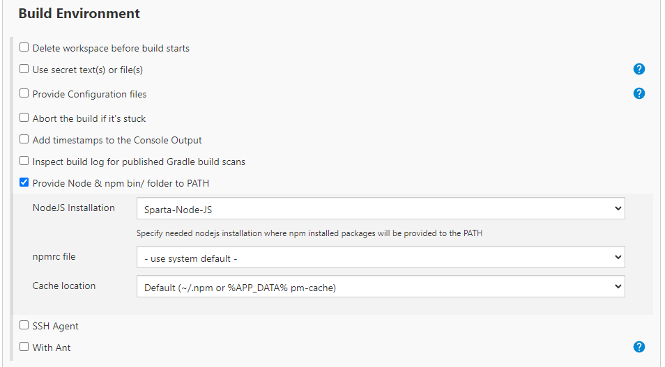

### How to set up the GitHub hook trigger for GITScm polling

go back to jenkins and configure your item, in Build Triggers tick the box, GitHub hook trigger for GITScm polling.

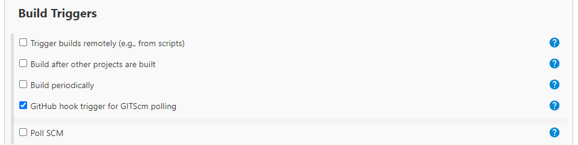

git add .
git commit 
how to have auto update in jenkins
tick the box in build triggers for configuration
GitHub hook trigger for GITScm polling

## Completing the CICD pipeline

Firstly let's start a dev branch on our chosesn repository, navigate to branches, new branch on github and type dev.

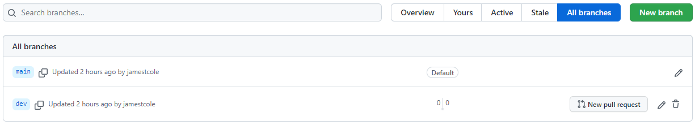

now in your gitbash terminal to update the details of your branches and change branch (while in your repository folder):

`git fetch`

`git checkout dev`

## Making a jenkins Pipeline to merge trees

### Testing the app in your Dev branch
To run a job on jenkins testing the app in your dev branch, simply change the */main branch specifier to dev, keep the other settings as normal. You should be able to see changes pushed to your dev branch in github.

### Automating the Dev and Main branch Merges
To automate it and merge the dev branch with your main branch, start a new Item in jenkins and change the following , in post build actions select build other projects and select your last item this is so that your dev branch still updates, select Trigger if build is stable.

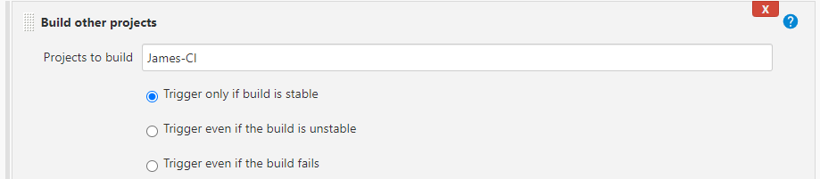

Then add Git Publisher, select Push only if build succeeds and merge results. In the pranches section add main and origin in Branch to push and Target remote name

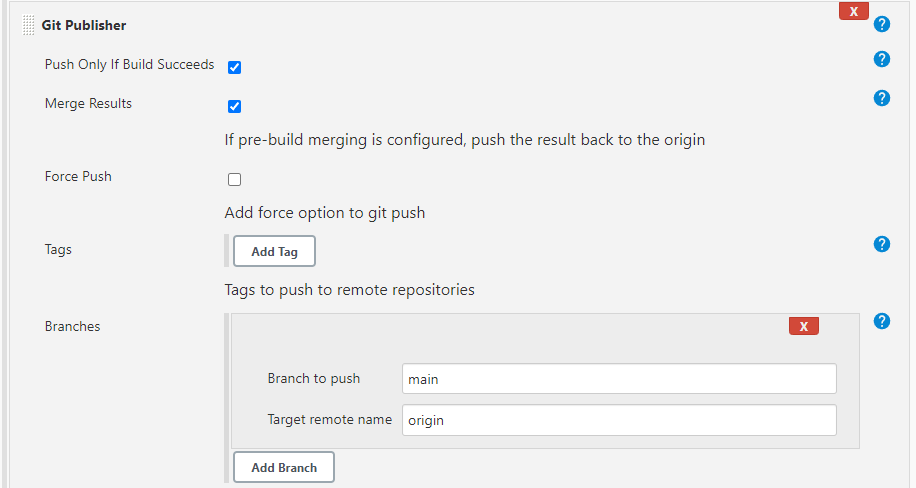

Now once you push a change from gitbash in your dev branch, it should automatically go to your main branch.

### Sending the Main Branch to the EC2 instance
To automate it so that if the branches are merged successfully, the main branch should be sent to an EC2 instance.

Change the build triggers to include the last item:

Provide SSH agaent details in build environment including a key made for this task.

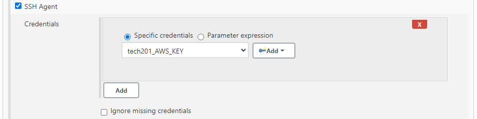

Now got to the execute shell, you should put in some commands to get your app up and running.

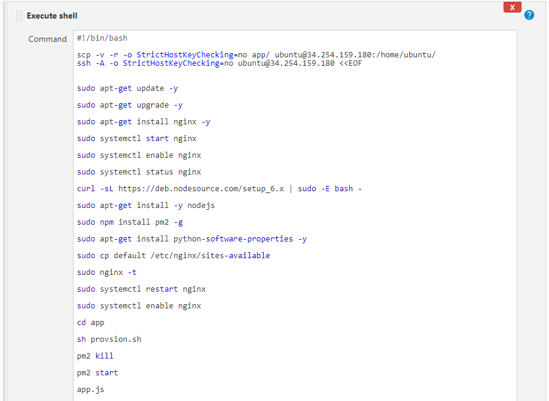

Now it is ready to be built, save the the changes and go to the aws EC2 console to start up your instance before you do.

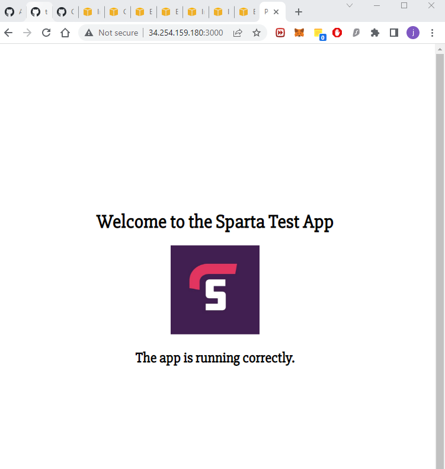

## Troubleshooting

### ssh access issues/denied/

Solution :

Make sure the public key in Git has write permissions , if it does not delete it and then remake it with write permissions.

- repository not found /url

### Can't ssh into ec2

make sure the security inbound rules are configured correctly there should be a port 22 your IP.

- port 22 issues
- Folder structure issues