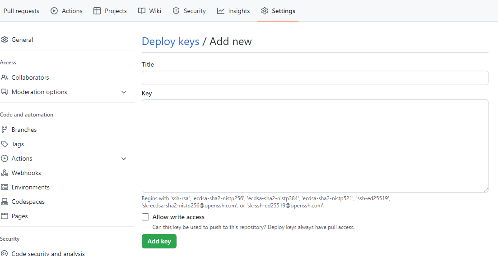

# Setting up the CI/CD in Jenkins

## Plan to set up the CI/CD in Jenkins

1. generate the ssh keypair in the .ssh folder
2. copy name_jenkin.pub
3. copy name_jenkins/private key to jenkins 
4. build a jenkins job with the repo trigger the job
	- app folder/code on github
	- cd ap
	- npm install
	- npm test pass/fail

## Jenkins Walkthrough

Make a new Item in jenkins and label it as per the naming convention , name-CI

In the configuration post bild actions:
- tick discard old builds, log rotation for a maximum of 3 builds.
- tick Github project with your HTTPS url copied from your repository

In the office 365 connector:
- tick restrict whre this project can be run and fill in the label expression, sparta-ubuntu-node

In the source code management:
- tick the Git box and add the ssh repository url, then add the key that you created earlier.
- change the branch specifier to main

To create the public and private key pair in gitbash , insert your email address in the following commands.

`cd .ssh`

`ssh-keygen -t rsa -b 4096 -C "JCole@spartaglobal.com"`

Once you have completed this, you can write (insert your keyname):

`cat keyname.pub`

This can now be copied into your repository settings on GitHub, got to settings, Deploy keys and copy without any spaces, then add the key.

How to Add the key:
click on the add key button, add your private key, this can be found by looking in your ssh folder. there should be a key labeled as the one you made earlier. 

`cd .ssh`

`cat keyname`

You can now copy and paste the output, remember to leave no spaces.

git add .
git commit 
how to have auto update in jenkins
tick the box in build triggers for configuration
GitHub hook trigger for GITScm polling

## Troubleshooting

- ssh access issues/denied/
- repository not found /url
- Can't ssh into ec2
- port 22 issues
- Folder structure issues