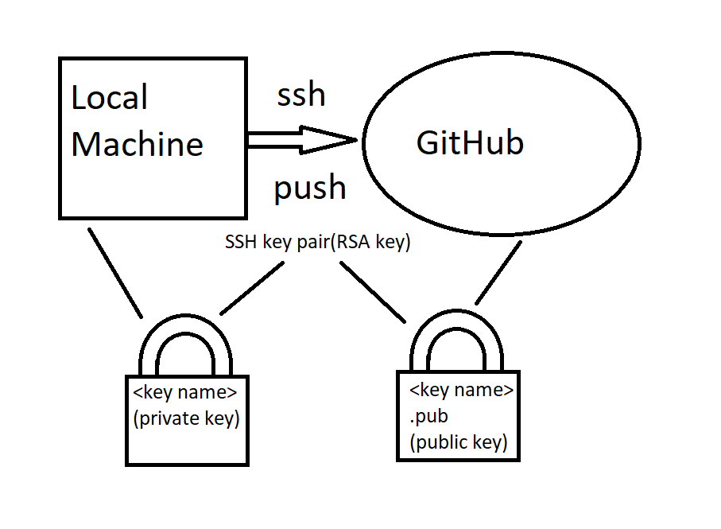
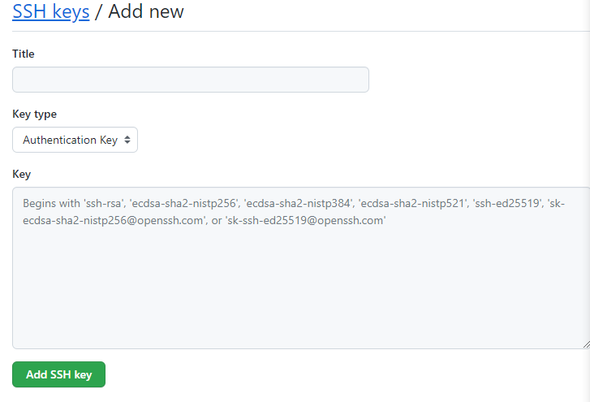

# Pushing using SSH and HTTPS

GitHub needs key pairs to transfer files from your local machine to the online repository. These pairs consist of a public key and a private key . while the public key can be generated from the private, the reverse is not possible. The private key should be kept safe and local.



## Generating the key pairs

Change directories to your ssh folder to start.

`cd .ssh`

Now use the following command to generate a key, with your own email address. pay attention to case and spaces or this will not work . Type it out rather than copy if necessary.

`ssh-keygen -t rsa -b 4096 -C "JCole@spartaglobal.com"`

This will ask a few questions, Enter github-key for where to be saved and enter on the others.
We can have a look at our key by using the following command

`cat github-key.pub`

Now copy and paste this into your github in the keys section. Go to profile, settings, SSH and GPG keys and click on New SSH key.Give it a title as per the naming conventions, ideally the same as the file in .ssh folder and remember to leave no spaces in the key area.



This should return the pid number so that a connction will be made to the authentication agent.

`eval 'ssh-agent'`

The follwing command wil now add the github key identity.

`ssh-add github-key`

## Pushing and pulling your content

Now navigate to your local repository directory, A new Directory can be made for this purpose , test-ssh.

`mkdir test-ssh`

Add a readme and some content with the following commands

`touch README.md`
`nano README.MD` # add a few lines

Let's now initiate our repository

`git init`

As this is being done for the first time do the following commands. Add your own origin from the github page SSH code.

```
git add .
git commit -m "added readme"
git branch -M main
git remote add origin git@github.com:jamestcole/test-ssh.
```