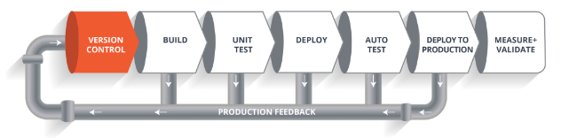

# Continuous Integration and Continuous Deployment
## What is CI-CD and CDE
CICD means continueous integration and continuous delivery whereas CDE means continuous deployment and is when new software is rolled out completeley automatically.CI/CD bridges the gap between development and operations teams by automating build, test and deployment of applications.

## difference between CD and CDE

The software is released frequently with CD but not automatically like with CDE, this offers advantages in terms of software reliability as it can be released at the pace of developers.

## What is Jenkins
Jenkins is the core of the CICD pipline, it has a huge number of plugins for building deploying and automating and supports distributed builds with master-slave architecture. Jenkins is how we can deploy the demonstrated code and automate the entire process.

## Benefits and alternatives to CICD

One alternative to CICD is CI with SAAS, Self-management of CICD allows you to control updates and upgrade on your own schedule. That means you’re can evaluate and learn new features before committing instead of them surprisingly coming in; this helps reduce training and frustration of your users when things go down. Self-management means that your team can roll back to old versions if things ever do go wrong. Vendor-managed (SaaS) tools come with the upside of simplicity but at the price of customizability and stability. Vendors update on their watch and aren’t as responsive to downtime as an internal team.

## A diagram of CI CD

The above pipeline is a logical demonstration of how a software will move along the various phases or stages in this lifecycle, before it is delivered to the customer or before it is live on production.

When the code is commited into a version control system like git, this is the version control phase.The build phase involves compiling and building necassery dependencies. The test phase involves testing such as a unit test. The Auto test phase can be run if this is all run successfully. Then the Deploy to production, once all testing is successfull.

So, this lifecycle continues until we get a code or a product which can be deployed in the production server where we measure and validate the code.

## Git work flow

## Jenkins work flow

## SDLC work flow stages

the planning stage where you are gathering requirements from your client or stakeholders and the requirement analysis stage where you’re looking into the feasibility of creating the product, revenue potential, the cost of production, the needs of the users etc. 

The design phase is where you put pen to paper—so to speak. The original plan and vision is elaborated into the basic structure of the software, including the system design, programming language, templates, platform to use, and application security measures. This is also where you can flowchart how the software responds to user actions.
The implementation phase is where the development team turns product specifications and business requirements into code that makes the product.

Before getting the software product out the door, it’s important to have your quality assurance team test it to make sure it is functioning properly and does what it’s meant to do. The testing process can also help hash out any major user experience issues and security issues. 

In some cases, software testing can be done in a simulated environment. Other simpler tests can also be automated. 

The maintenance stage is the final stage of the SDLC if you’re following the waterfall structure of the software development process. However, the industry is moving towards a more agile software development approach where maintenance is only a stage for further improvement. 

In the maintenance stage, users may find bugs and errors that were missed in the earlier testing phase. These bugs need to be fixed for better user experience and retention. In some cases, these can lead to going back to the first step of the software development life cycle. 

